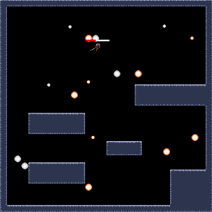

## Bullet Platformer
A platformer game built with SDL2 where the player dodges projectiles instantiated around the level.



## Dependencies
```
SDL2
SDL2_image
SDL2_ttf
```

## Build and Run
```
$ g++ source.cpp -w -lSDL2main -lSDL2 -lSDL2_image -lSDL2_ttf -o source
$ ./source
```

## Resources
- [Hero Knight Sprite](https://stensven.itch.io/hero-knight)
- [Fantasy Pixel Art Tileset](https://mostbestestgames.itch.io/fantasy-pixelart-tileset)
- [Projectiles](https://kicked-in-teeth.itch.io/projectiles)